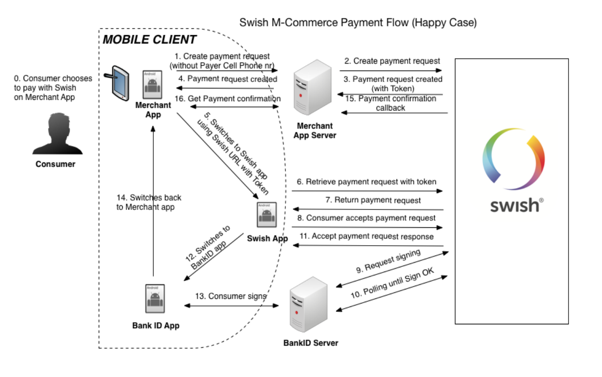

# swishbit
### Architecture
```
            client >.<-<-<-<-<-<-.
                    v            ^
 (amount, address)  v            ^
                    v            ^
                    v            ^
                  swish transaction
                    v            ^
             swish bank account -^
                    v            ^
                    v            ^
       .-<-<-payment gateway ->-^ (onerror)
       v            v
       v            v
  currency api ->->-+->->->->->->->.
                    v              v
       (BTC amount) v        (fee) v
                    v              v
            client address   swishbit address
```

#### Payment gateway
##### Requirements
- users should be able to make a swish payment and receive bitcoins to provided address
- verify bitcoin address
- log the requested transaction
- ensure sufficient balance
- convert SEK/BTC
- calculate fee
- transfer to address
  - return SEK to user on error

#### API endpoints
```
/transfer
/paymentrequests (swish callback)
```

##### Roadmap
- simply swish SEK and address to <number>
- track transaction with sms
- bot to buy BTC
  - track price changes
  - machine learning
- global market
- ethereum

#### Client
- legal notices (swish 1 SEK to confirm?)
- input SEK
- input BTC adress
- submit launches Swish
  - Swish callbacks to payment gateway
- event log to track transaction
- faq
  - how to create and store wallet (address) safely
  - ...


#### Swish

